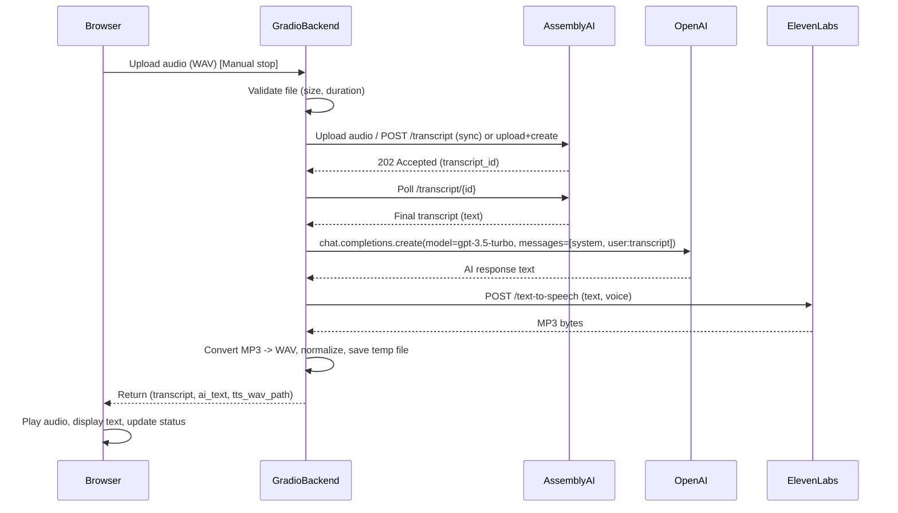

# Design document

## Goals

* Build a browser-based MVP interview voicebot using:

  * AssemblyAI for transcription.
  * OpenAI `gpt-3.5-turbo` for LLM responses (cheapest).
  * ElevenLabs for natural-sounding TTS.
* Manual-stop recording for turn-taking.
* Full-response TTS (generate audio after LLM finishes).
* Keep costs minimal using free credits + cheap GPT.
* Maintain simple, understandable, production-minded architecture that can be iterated later.

## Non-functional requirements

* Responsiveness: typical roundtrip (upload → transcript → reply → TTS → playback) should be acceptable for short audio (≤10s).
* Reliability: retries and backoff for transient failures.
* Security: environment variables for API keys, HTTPS for production.
* Privacy: log minimal metadata, keep audio retention transient (delete after serving).
* Observability: logs + basic metrics for latency & errors.

## Components

1. **Gradio Frontend**

   * Microphone input (WAV), manual start/stop.
   * Buttons: Record / Stop / Play / Clear.
   * Displays: Transcript, AI Response, Status.
   * Audio player component for returned TTS file (`type="filepath"`).

2. **Backend (Python on the same Gradio process)**

   * Request handler(s):

     * `process_voice`: receives audio file → orchestrates rest of pipeline.
     * `process_text` (optional): handle typed questions.
   * Workers: optionally thread-based job runner for TTS generation to avoid blocking (but for MVP, Gradio queue can suffice).
   * Temp file manager: create temp files per request and delete them on a short timer (or after response served).

3. **Third-party APIs**

   * **AssemblyAI REST**: `POST /transcript` w/ `audio_url` or `file` upload → poll for completion or use webhook (polling is simpler for MVP).
   * **OpenAI**: `chat.completions.create(model="gpt-3.5-turbo", messages=[...])`.
   * **ElevenLabs**: TTS REST (generate audio for a given text + voice).

## Data flow & formats

* Audio from browser: WAV PCM 16kHz or 16-bit 44.1kHz (AssemblyAI supports multiple formats; normalize if needed).
* Transcript: plain text.
* Prompt sent to OpenAI:

  ```json
  [
    {"role": "system", "content": "<persona + style rules>"},
    {"role": "user",   "content": "<transcript>"}
  ]
  ```
* LLM response: plain text trimmed to 2–4 sentences.
* TTS API: pass `text` and `voice` → returns audio bytes (MP3 or WAV). Convert to WAV for Gradio.

## State & session

* Per-request ephemeral state:

  * `request_id`, `start_time`, `file_paths`, `transcript`, `ai_text`, `tts_path`
* No long-lived conversation state in MVP (or keep a tiny sliding context of last N turns if you want brief continuity).
* If you keep any transcript context, limit tokens and summarize old context periodically.

## Error handling

* Validate audio size/duration; reject >10s or >5MB with user-friendly message.
* Backoff & retry for temporary API errors (3 tries with exponential backoff).
* On failure at any step, return a helpful error to the UI and log full stacktrace server-side.
* Circuit breaker: if a provider is down repeatedly, return a short fallback message ("Sorry, our speech service is unavailable").

## Temp file management

* Create temporary audio files in OS tempdir with unique names.
* Delete temp files immediately after sending the file path to Gradio response, or schedule deletion after a short TTL (e.g., 60s).
* Alternatively return in-memory bytes to Gradio as `type="numpy"` to avoid files (but file paths are simpler and more robust).

## Security & keys

* Use environment variables for API keys. Never hardcode.
* For local dev use `.env` (as you already do), but in production use vault or environment-specific secrets.
* Enforce HTTPS and CORS policies for production deployment.
* Log only non-sensitive metadata (no audio content logs unless explicitly needed with consent).

## Monitoring & metrics

* Metrics to record: transcription latency, LLM latency, TTS latency, overall roundtrip, request success vs failure rate.
* Basic logging (INFO & ERROR).

## Cost considerations

* AssemblyAI: free credits for initial testing. Use REST transcription (short files) — cheap.
* ElevenLabs: free tier for limited text-to-speech; enough for MVP volume testing.
* OpenAI: `gpt-3.5-turbo` is inexpensive; estimate per short request a few tenths of a cent. Add budget alerts in production.

## MVP tradeoffs (explicit)

* No streaming LLM tokens to the UI (we will simulate incremental status messages). Rationale: simpler and avoids complex websockets/state for first iteration.
* Full-response TTS only (no incremental audio streaming). Simpler and fits Gradio well.
* Manual stop for recording: explicit, reliable, easy to implement in Gradio.

---

# Sequence diagram

Below is a Mermaid sequence diagram describing the end-to-end flow for a single voice turn. (If your environment supports Mermaid, paste the block into a renderer; otherwise the ASCII-like text explains the steps.)



### Notes on the diagram

* Polling vs webhook tradeoff: for MVP, **polling** AssemblyAI for transcript completion is easier to implement. Webhooks are more efficient but require a publicly reachable endpoint (or ngrok) and extra reliability code.
* The diagram uses a synchronous, blocking flow on the backend but behind Gradio’s `queue()` — that is okay for an MVP if you cap concurrency and keep requests short.

---

# Detailed sequence of operations (step-by-step request lifecycle)

1. **User records** (Browser/Gradio)

   * Gradio records audio as WAV and stores it temporarily on the client.
   * User presses **Stop**; Gradio uploads audio to server (multipart/form-data).

2. **Server validation**

   * Check file exists, duration <= MAX\_RECORD\_SECONDS, size <= limit.
   * Compute `request_id`, start timer, log entry.

3. **Transcription**

   * Upload audio bytes to AssemblyAI (either file upload + create transcript or pass file directly).
   * Receive `transcript_id`.
   * Poll `/transcript/{id}` every 1s (or with exponential backoff) until `status == 'completed'` or timeout (e.g., 30s).
   * On completion, get `text`.

4. **Generate response**

   * Build `messages` with a compact system prompt for interview persona and the transcript.
   * Call OpenAI: `chat.completions.create(model='gpt-3.5-turbo', messages=..., max_tokens=150)`.
   * Receive reply text, run minimal post-processing:

     * Trim whitespace.
     * Enforce max length (2–4 sentences).
     * Optionally run a secondary safety/moderation API (if desired).

5. **TTS**

   * Call ElevenLabs TTS with reply text and desired voice.
   * Receive MP3 bytes.
   * Convert to WAV (AudioSegment), ensure sample rate consistent with Gradio expectations (e.g., 16k or 44.1k), normalize dtype to float32 \[-1,1].
   * Save WAV to a temp path.

6. **Return & cleanup**

   * Respond to Gradio with `transcript`, `ai_text`, and `tts_wav_path`.
   * Schedule deletion of `tts_wav_path` after e.g., 60 seconds (or delete on next request).
   * Log latencies & status.

---

# Implementation considerations & decisions to finalize before coding

1. **AssemblyAI: upload approach**

   * Option A (REST upload+create): upload the file to AssemblyAI, then create transcript resource and poll. Simple for backend.
   * Option B (Realtime): more complex (WebSocket) and better for streaming interim transcripts — not needed for MVP since we use manual stop.

2. **ElevenLabs audio format**

   * Confirm ElevenLabs returns MP3 bytes in the endpoint you use. Convert to WAV for Gradio `type="filepath"` audio component.

3. **Polling interval & transcript timeout**

   * Poll every 1s with max wait of 30s. Fail with a friendly message if exceeded.

4. **Concurrency**

   * Use `demo.queue()` with `max_size=1` or small concurrency to avoid hitting API quotas accidentally during dev. For higher throughput, add worker pool and async HTTP client.

5. **Privacy**

   * Prompt user for consent to send audio to third parties. Store transcripts only briefly.

6. **Logging & debugging**

   * Log at DEBUG locally. Sanitize any logs before saving to persistent storage.

---

# Risks and mitigations

* **High latency occasionally**: assemblyAI/OpenAI/ElevenLabs might be slow; mitigate with timeouts and user-facing status messages.
* **API quota exhaustion**: enforce per-user and per-app quotas, cost alerts.
* **Audio playback issues**: ensure returned WAV is normalized; prefer `type="filepath"` in Gradio to avoid numpy shape/type mismatches.
* **Temp file leakage**: enforce deletion in a `finally` block and periodic sweeper job.
* **Edge cases in transcription**: return helpful messages when transcript is empty or conf low.

---

# Acceptance criteria for the design (what “100% sure” means)

Before starting coding, confirm:

1. Use-case constraints:

   * Browser-based Gradio app: confirmed.
   * Manual stop recording: confirmed.
   * Full-response TTS only: confirmed.
   * LLM: `gpt-3.5-turbo`: confirmed.
2. Provider selection:

   * AssemblyAI for transcription (REST), ElevenLabs for TTS, OpenAI for LLM: confirmed.
3. Operational limits:

   * Max recording length 10s, max size 5MB, polling timeout 30s: confirm or adjust.
4. Security & privacy:

   * Use env vars for credentials and show consent to users: confirm.
5. Resource cleanup approach:

   * Temp audio files deleted immediately after sending or scheduled TTL: confirm.

---

# Next steps checklist (if you approve)

* Choose final config values (max duration, file size limit, polling interval).
* Confirm system prompt for `gpt-3.5-turbo` (I can draft a concise persona prompt).
* I will then produce the **detailed backend Gradio code** implementing the pipeline, with:

  * robust error handling,
  * polling logic for AssemblyAI,
  * secure env var usage,
  * ElevenLabs TTS conversion and normalization,
  * temp file cleanup.
* Include unit-testable functions where possible and docstrings.
